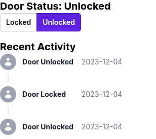

# Cat Door Manager
An application to manage my parents' automatic cat door. This repository is public so my father can keep track of my progress on the code. Hi Dad :)

## Learning Outcomes
This project will hopefully teach me a number of valuable skills across the stack: Next JS, Tailwind CSS, Flask, and Raspberry Pi/Hardware programming. A stretch goal would be to develop a way to package and push this software remotely, to update the cat door live, using GitHub actions.

## Current State
Basic front-end set up, very incomplete:

Got some API actions sorted. These will allow us to test the back-end of the application:

- Next up I'd like to pull in more database libraries for Flask. Flask is a very lightweight server-side library, so we need to pull in extra libraries to handle anything outside of basic web-app behaviour, like better database control.
- Migrations are a standard feature in many applications. Maybe you already know, but in case not: a migration is basically a file containing code to manipulate the database in some way e.g. adding/removing a column, renaming a column, adding a table, etc.
- Migrations let us make changes to the database without losing data.
